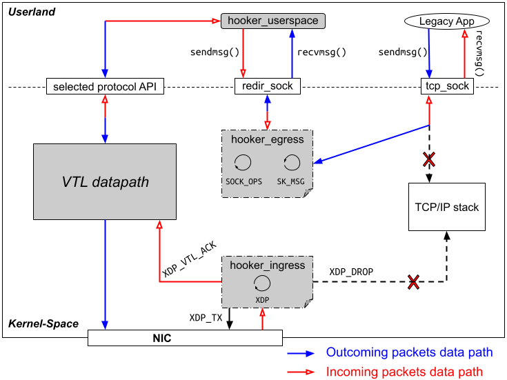

# Hooker

**Hooker** is a key component designed to provide transparent support for legacy applications, allowing them to use transport protocols other than TCP without requiring modifications to their source code. While it is part of a broader architecture (VTL - Virtual Transport Layer), this repository focuses specifically on the code and mechanisms related to Hooker. We can read an in-depth presentation of the VTL on [GitHub](https://github.com/elfadel/vtl) or [Github](https://github.com/dctape/Virtual-Transport-Layer).

## <a name="hk" /> Hooker Overview

The primary goal of the **Hooker** component is to support existing applications without the need for code changes. It integrates at the operating system level to intercept and redirect data packets sent to and from applications.

### Hooker's Internal Functioning

1. **Attachment to cgroups**: Hooker attaches to the root of `cgroupv2`, leveraging the hierarchical model of cgroups to process every ingress and egress packet from all processes running on the end-system.

2. **Connection Management**: Hooker maintains a `SOCKMAP` where the key is a structure containing addressing information. This key is used by the `msg redirector` program to redirect packet data to the correct socket.

3. **Packet Interception**: Whenever an application process sends a data packet via `sendmsg()` on a TCP socket, Hooker's `SK_MSG` program intercepts it, rewrites it if necessary, and then uses `bpf_msg_redirect_map()` to deliver the message either to the redirection socket or the original TCP socket.

4. **Packet Redirection**: The redirection socket is managed by Hooker's user-space program, which receives the redirected data packets and forwards them to the VTL data path via a protocol-agnostic API.

5. **Processing Incoming Packets**: When the system's network interface card (NIC) receives a data packet, Hooker's XDP program intercepts and processes it by issuing the appropriate verdict (e.g., XDP_DROP to discard the packet, XDP_TX to redirect it to the same NIC, or XDP_VTL_ACK to pass it to the VTL data path for further processing).

## Publications

* El-Fadel Bonfoh, D. C. Tape, C. Chassot, S. Medjiah, “Transparent and Dynamic Deployment of Lightweight Transport Protocols”, The 2019 IEEE Global Communications Conference (GLOBECOM), December 2019, Waikoloa, Hawaii, USA.

